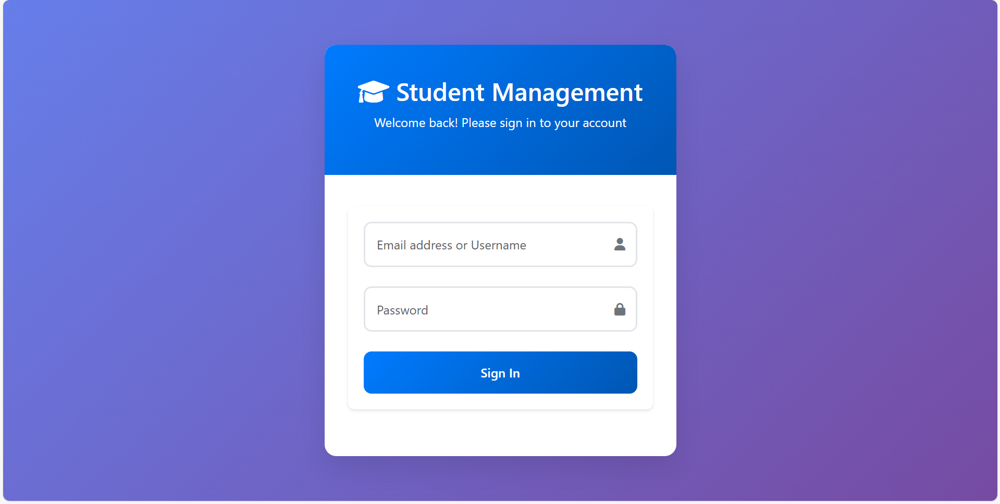
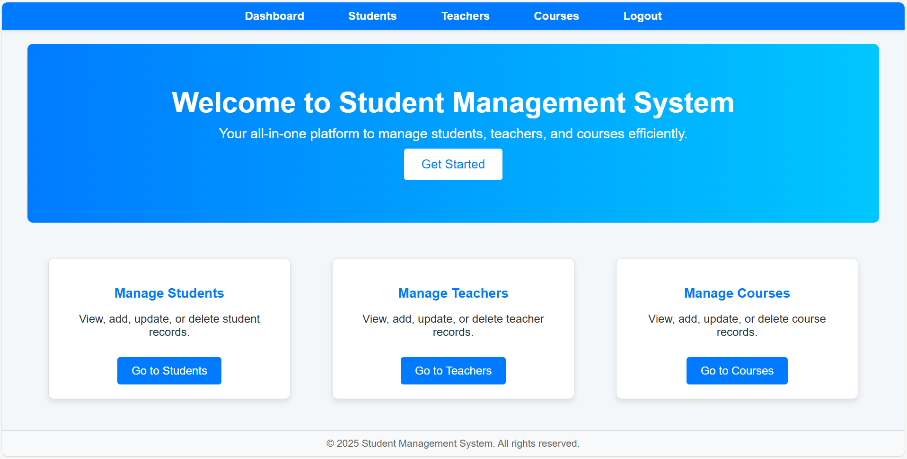
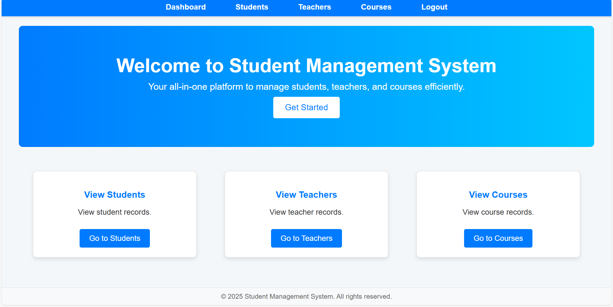
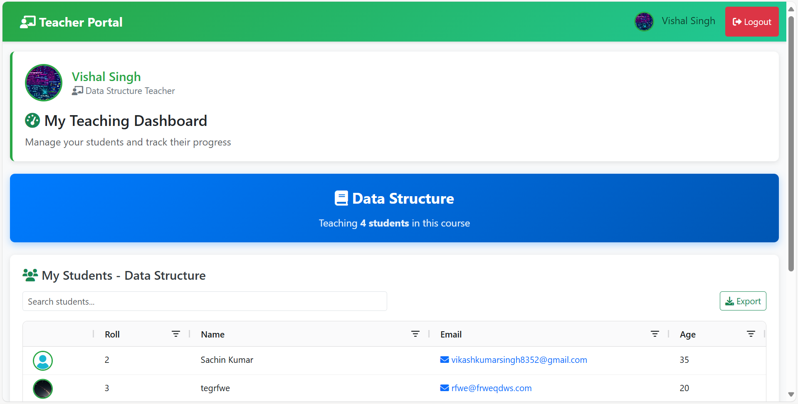
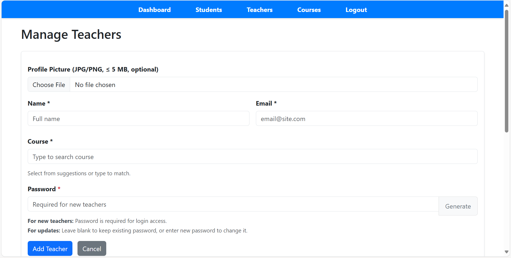
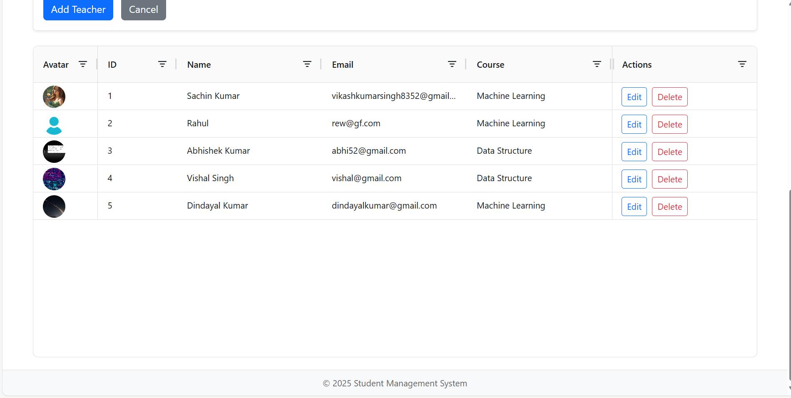
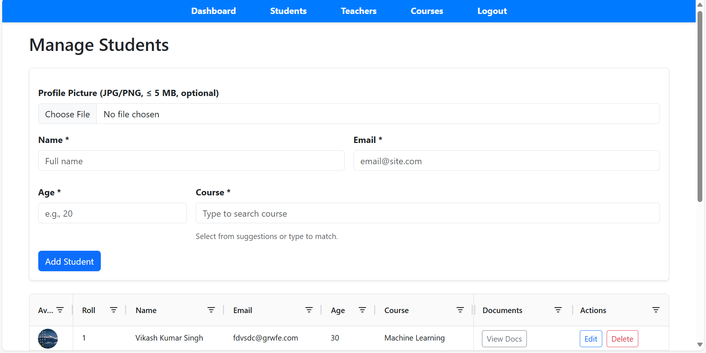
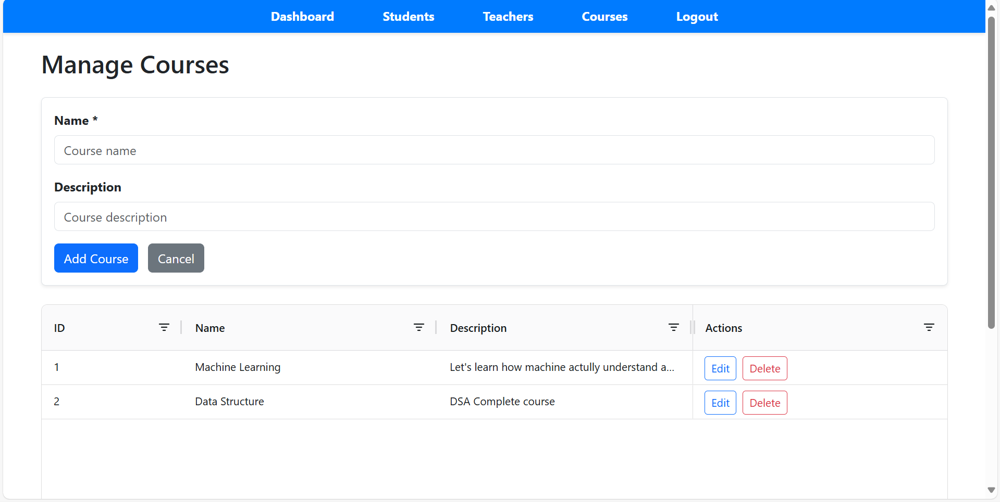
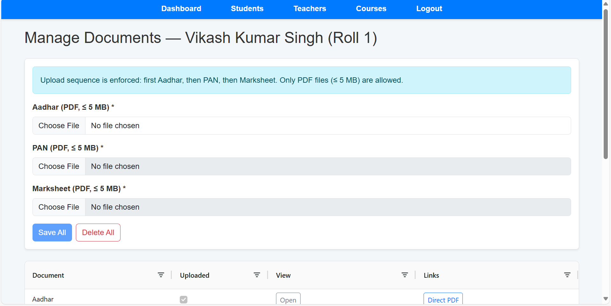
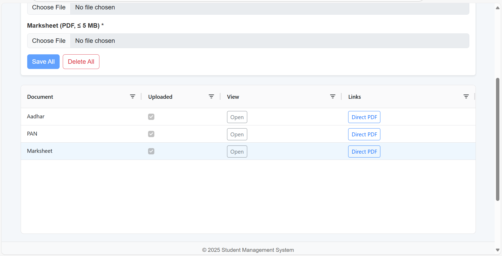

# Student Management System

<div align="center">
  
</div>

[](https://opensource.org/licenses/MIT)
[](https://www.java.com/)
[](https://spring.io/projects/spring-boot)
[](https://www.mysql.com/)

A comprehensive enterprise-level full-stack web application for managing students, teachers, courses, and documents in an educational setting. Features session-based authentication systems, document management, profile handling, role-based access control, and real-time dashboards. Built with Spring Boot backend and modern responsive frontend with professional UI components.

This project demonstrates enterprise-level Spring Boot concepts including JPA with stored procedures, Spring Security with session management, comprehensive file upload handling, RESTful APIs, document management systems, and professional responsive UI with Bootstrap and AG Grid.

## Table of Contents

* [Features](#features)
* [Tech Stack](#tech-stack)
* [Project Structure](#project-structure)
* [Installation](#installation)
* [Database Setup](#database-setup)
* [API Endpoints](#api-endpoints)
* [Usage](#usage)
* [Screenshots](#screenshots)
* [Contributing](#contributing)
* [License](#license)
* [Contact](#contact)


## Features

### 🔐 Authentication \& Authorization

* **Multi-Role System**: Admin, User, and Teacher roles with granular permissions
* **Session-Based Authentication**: Secure session management with Spring Security
* **In-Memory Authentication**: Admin and User roles with configurable credentials
* **Teacher Database Authentication**: Teachers authenticate using email/password stored in database
* **Session Management**: Automatic session timeout and security features
* **Role-Based Access Control**: Protected endpoints based on user roles


### 👥 Comprehensive User Management

* **Student Management**: Complete CRUD with profile pictures, course assignments, and document tracking
* **Teacher Management**: Teacher profiles with authentication, course assignments, and personalized dashboards
* **Course Management**: Advanced course creation with teacher and student assignments
* **Document Management**: Complete document lifecycle management for student records
* **Profile Pictures**: Upload, serve, and manage profile images for all user types


### 📄 Document Management System

* **Document Upload**: Secure upload system for Aadhar, PAN, Marksheet, and other documents
* **Document Tracking**: Real-time status tracking of document uploads and verification
* **Document Serving**: Secure document serving with access controls
* **PDF Viewer**: Built-in PDF viewing capabilities
* **Storage Management**: Organized file storage with automatic directory management


### 🖼️ Advanced File \& Media Handling

* **Profile Picture Management**: Upload, resize, and serve profile pictures
* **Document Storage**: Secure document storage with organized directory structure
* **File Validation**: Comprehensive file type, size, and security validation
* **Image Serving**: Dynamic image serving with caching and optimization
* **Storage Services**: Dedicated storage services for different file types


### 📊 Professional Dashboards \& UI

* **Admin Dashboard**: Comprehensive management interface with analytics
* **Teacher Dashboard**: Personalized dashboard showing assigned students, courses, and analytics
* **Student Portal**: Student-specific interface for document management
* **Document Dashboard**: Specialized interface for document management and tracking
* **Responsive Design**: Mobile-first responsive design with Bootstrap 5
* **Advanced Data Grids**: AG Grid with search, filter, sort, pagination, and export
* **Real-time Updates**: Dynamic content updates with AJAX


### 🔧 Enterprise Technical Features

* **Advanced Stored Procedures**: Complex MySQL stored procedures with JSON payload handling
* **RESTful API Design**: Comprehensive REST API with proper HTTP status codes and error handling
* **Session Management**: Secure session handling with timeout and validation
* **File Upload Security**: Advanced file upload security with validation and sanitization
* **Login Management**: Sophisticated login tracking and session management
* **Export Functionality**: Advanced data export capabilities with multiple formats


## Tech Stack

### Backend Technologies

* **Java 17** - Latest LTS version with modern features
* **Spring Boot 3.x** - Main application framework
* **Spring Security** - Authentication, authorization, and session management
* **Spring Data JPA** - Database operations with advanced Hibernate features
* **HttpSession** - Session-based authentication and state management
* **MySQL 8.x** - Primary database with advanced stored procedures
* **Maven** - Build automation and dependency management


### Frontend Technologies

* **HTML5 \& CSS3** - Modern semantic markup and styling
* **Bootstrap 5** - Professional responsive CSS framework
* **JavaScript (ES6+)** - Modern JavaScript with async/await
* **jQuery** - Enhanced DOM manipulation and AJAX operations
* **AG Grid Community** - Enterprise-level data grid with advanced features
* **Font Awesome 6** - Comprehensive icon library


### File \& Storage Management

* **MultipartFile Handling** - Advanced Spring Boot file upload processing
* **Organized File Storage** - Structured external storage system
* **Document Management** - Complete document lifecycle management
* **Image Processing** - Dynamic image serving and optimization
* **Security Validation** - File type and content validation


## Project Structure

```
StudentManagement/
├── docs/
│   ├── images/
│   │   └── student_management_logo.png    # Project logo
│   └── screenshots/                       # Application screenshots
│       ├── login.png                      # Login page
│       ├── admin-dashboard.png            # Admin dashboard
│       ├── teacher-dashboard.png          # Teacher dashboard
│       ├── student-management.png         # Student management page
│       ├── teacher-management.png         # Teacher management page
│       ├── course-management.png          # Course management page
│       ├── document-management.png        # Document management page
│       ├── profile-upload.png             # Profile picture upload
│       ├── document-upload.png            # Document upload interface
│       └── data-export.png                # Data export functionality
├── src/
│   ├── main/
│   │   ├── java/com/example/StudentManagement/
│   │   │   ├── StudentManagementApplication.java
│   │   │   ├── config/                    # Configuration classes
│   │   │   │   ├── SecurityConfig.java    # Spring Security configuration
│   │   │   │   └── WebConfig.java         # Web MVC configuration
│   │   │   ├── controller/                # REST controllers
│   │   │   │   ├── CourseController.java  # Course CRUD operations
│   │   │   │   ├── DocumentController.java # Document management
│   │   │   │   ├── LoginController.java   # Login operations
│   │   │   │   ├── RootController.java    # Root endpoint handling
│   │   │   │   ├── StudentController.java # Student CRUD operations
│   │   │   │   ├── TeacherController.java # Teacher management
│   │   │   │   ├── UnifiedAuthController.java # Unified authentication
│   │   │   │   └── UserController.java    # User role management
│   │   │   ├── dao/                       # Data Access Objects
│   │   │   │   ├── CourseDao.java
│   │   │   │   ├── DocumentDao.java       # Document data operations
│   │   │   │   ├── LoginRequest.java      # Login request DTO
│   │   │   │   ├── LoginResponse.java     # Login response DTO
│   │   │   │   ├── StudentDao.java
│   │   │   │   └── TeacherDao.java
│   │   │   ├── entity/                    # JPA Entities
│   │   │   │   ├── Course.java
│   │   │   │   ├── Document.java          # Document entity
│   │   │   │   ├── Student.java           # Enhanced student entity
│   │   │   │   └── Teacher.java           # Enhanced teacher entity
│   │   │   ├── filter/                    # Security filters
│   │   │   │   └── JwtAuthenticationFilter.java # JWT authentication filter
│   │   │   ├── service/                   # Business logic services
│   │   │   │   ├── CourseService.java
│   │   │   │   ├── DocumentService.java   # Document business logic
│   │   │   │   ├── StudentService.java
│   │   │   │   ├── TeacherService.java
│   │   │   │   └── TeacherUserDetailsService.java # User details service
│   │   │   ├── storage/                   # Storage services
│   │   │   │   ├── DocumentStorageService.java # Document storage handling
│   │   │   │   └── FileStorageService.java # General file storage
│   │   │   └── util/                      # Utility classes
│   │   │       ├── JwtUtil.java           # JWT token utilities
│   │   │       ├── SpEnums.java           # Stored procedure enums
│   │   │       ├── SpPayloadUtil.java     # JSON payload utilities
│   │   │       └── StoredProcClient.java  # Stored procedure client
│   │   └── resources/
│   │       ├── application.properties     # Application configuration
│   │       └── static/                    # Static web resources
│   │           ├── courses.html           # Course management page
│   │           ├── dashboard.html         # Admin dashboard
│   │           ├── documents.html         # Document management page
│   │           ├── index.html             # Landing page
│   │           ├── login.html             # Unified login page
│   │           ├── pdf-view.html          # PDF viewer page
│   │           ├── students.html          # Student management page
│   │           ├── teacher-dashboard.html # Teacher-specific dashboard
│   │           ├── teachers.html          # Teacher management page
│   │           ├── css/
│   │           │   └── shared.css         # Global styles
│   │           ├── images/
│   │           │   └── default_profile_pic.jpg # Default profile picture
│   │           └── js/
│   │               └── shared.js          # Global JavaScript utilities
│   └── test/
│       └── java/com/example/StudentManagement/
│           └── StudentManagementApplicationTests.java
├── uploads/                               # External file storage
│   └── image/
│       ├── docs/                          # Student documents by student ID
│       │   ├── 1/                         # Student ID 1 documents
│       │   │   ├── aadhar.pdf
│       │   │   ├── pan.pdf
│       │   │   └── marksheet.pdf
│       │   └── 2/                         # Student ID 2 documents
│       ├── StudentPic/                    # Student profile pictures
│       │   ├── 1_profile.png
│       │   ├── 3_profile.jpg
│       │   └── 4_profile.jpg
│       └── TeacherPic/                    # Teacher profile pictures
│           ├── 1_profile.jpg
│           ├── 3_profile.png
│           └── 4_profile.png
├── .gitignore
├── LICENSE                                # MIT License
├── mvnw                                   # Maven wrapper (Unix)
├── mvnw.cmd                               # Maven wrapper (Windows)
├── pom.xml                                # Maven dependencies and build configuration
└── README.md                              # This file
```


## Installation

### Prerequisites

* **Java 17+** (JDK) - Required for Spring Boot 3.x
* **Maven 3.8+** - Build automation tool
* **MySQL 8.0+** - Primary database server
* **Git** - Version control


### Setup Steps

1. **Clone the Repository**:
```bash
git clone https://github.com/ItsMeVikashKumarSingh/Student-Management.git
cd Student-Management
```

2. **Configure Application** (Edit `src/main/resources/application.properties`):
```properties
# Database Configuration
spring.datasource.url=jdbc:mysql://localhost:3306/studentdb?useSSL=false&serverTimezone=UTC
spring.datasource.username=root
spring.datasource.password=yourpassword
spring.jpa.hibernate.ddl-auto=none
spring.jpa.show-sql=true

# File Upload Configuration
spring.servlet.multipart.max-file-size=10MB
spring.servlet.multipart.max-request-size=10MB
spring.servlet.multipart.enabled=true

# Session Configuration
server.servlet.session.timeout=30m
spring.session.store-type=none
spring.security.require-ssl=false

# Server Configuration
server.port=8080
```

3. **Create Upload Directories**:
```bash
mkdir -p uploads/image/StudentPic
mkdir -p uploads/image/TeacherPic
mkdir -p uploads/image/docs
```

4. **Build and Run**:
```bash
mvn clean install
mvn spring-boot:run
```

5. **Access Application**:

* Main Login: `http://localhost:8080/login.html`
* Admin Dashboard: `http://localhost:8080/dashboard.html` (after login)
* Teacher Dashboard: `http://localhost:8080/teacher-dashboard.html` (after teacher login)


## Database Setup

### 1. Create Database

```sql
CREATE DATABASE IF NOT EXISTS studentdb;
USE studentdb;
```


### 2. Create Tables

```sql
-- Course table
CREATE TABLE IF NOT EXISTS coursetable (
  id INT AUTO_INCREMENT PRIMARY KEY,
  name VARCHAR(255) NOT NULL,
  description TEXT,
  status VARCHAR(20) DEFAULT 'ACTIVE',
  created_at TIMESTAMP DEFAULT CURRENT_TIMESTAMP,
  updated_at TIMESTAMP DEFAULT CURRENT_TIMESTAMP ON UPDATE CURRENT_TIMESTAMP
);

-- Student table with enhanced features
CREATE TABLE IF NOT EXISTS studenttable (
  roll INT AUTO_INCREMENT PRIMARY KEY,
  name VARCHAR(100) NOT NULL,
  email VARCHAR(100) NOT NULL UNIQUE,
  age INT NOT NULL,
  course_id INT NOT NULL,
  profile_picture_name VARCHAR(255),
  created_at TIMESTAMP DEFAULT CURRENT_TIMESTAMP,
  updated_at TIMESTAMP DEFAULT CURRENT_TIMESTAMP ON UPDATE CURRENT_TIMESTAMP,
  FOREIGN KEY (course_id) REFERENCES coursetable(id) ON DELETE RESTRICT
);

-- Teacher table with authentication
CREATE TABLE IF NOT EXISTS teachertable (
  id INT AUTO_INCREMENT PRIMARY KEY,
  name VARCHAR(255) NOT NULL,
  email VARCHAR(255) NOT NULL UNIQUE,
  password VARCHAR(255) NOT NULL,
  course_id INT NOT NULL,
  profile_picture_name VARCHAR(255),
  created_at TIMESTAMP DEFAULT CURRENT_TIMESTAMP,
  updated_at TIMESTAMP DEFAULT CURRENT_TIMESTAMP ON UPDATE CURRENT_TIMESTAMP,
  FOREIGN KEY (course_id) REFERENCES coursetable(id) ON DELETE RESTRICT
);

-- Document management table
CREATE TABLE IF NOT EXISTS documenttable (
  student_roll INT PRIMARY KEY,
  aadhar_name VARCHAR(255),
  pan_name VARCHAR(255),
  marksheet_name VARCHAR(255),
  aadhar_uploaded BOOLEAN DEFAULT FALSE,
  pan_uploaded BOOLEAN DEFAULT FALSE,
  marksheet_uploaded BOOLEAN DEFAULT FALSE,
  created_at TIMESTAMP DEFAULT CURRENT_TIMESTAMP,
  updated_at TIMESTAMP DEFAULT CURRENT_TIMESTAMP ON UPDATE CURRENT_TIMESTAMP,
  FOREIGN KEY (student_roll) REFERENCES studenttable(roll) ON DELETE CASCADE
);
```


### 3. Create Complete Stored Procedure

```sql
-- Complete Stored Procedure for all CRUD operations
DROP PROCEDURE IF EXISTS sp_manage;
DELIMITER $$
CREATE PROCEDURE sp_manage(
  IN p_entity VARCHAR(16),
  IN p_action VARCHAR(16),
  IN p_payload JSON
)
BEGIN
  -- =========================
  -- COURSE ENTITY OPERATIONS
  -- =========================
  IF p_entity = 'COURSE' THEN
    IF p_action = 'ADD' THEN
      INSERT INTO coursetable(name, description)
      VALUES (
        JSON_UNQUOTE(JSON_EXTRACT(p_payload, '$.name')),
        JSON_UNQUOTE(JSON_EXTRACT(p_payload, '$.description'))
      );
      SELECT LAST_INSERT_ID() AS new_id;
    ELSEIF p_action = 'UPDATE' THEN
      UPDATE coursetable
      SET name = COALESCE(JSON_UNQUOTE(JSON_EXTRACT(p_payload, '$.name')), name),
          description = COALESCE(JSON_UNQUOTE(JSON_EXTRACT(p_payload, '$.description')), description)
      WHERE id = CAST(JSON_UNQUOTE(JSON_EXTRACT(p_payload, '$.id')) AS UNSIGNED);
      SELECT CAST(JSON_UNQUOTE(JSON_EXTRACT(p_payload, '$.id')) AS UNSIGNED) AS updated_id;
    ELSEIF p_action = 'DELETE' THEN
      DELETE FROM coursetable
      WHERE id = CAST(JSON_UNQUOTE(JSON_EXTRACT(p_payload, '$.id')) AS UNSIGNED);
      SELECT CAST(JSON_UNQUOTE(JSON_EXTRACT(p_payload, '$.id')) AS UNSIGNED) AS deleted_id;
    ELSEIF p_action = 'GET' THEN
      SELECT id, name, description FROM coursetable;
    ELSEIF p_action = 'GET_COURSE_NAME' THEN
      SELECT name FROM coursetable WHERE id = CAST(JSON_UNQUOTE(JSON_EXTRACT(p_payload, '$.id')) AS UNSIGNED);
    END IF;

  -- =========================
  -- STUDENT ENTITY OPERATIONS
  -- =========================
  ELSEIF p_entity = 'STUDENT' THEN
    IF p_action = 'ADD' THEN
      INSERT INTO studenttable(name, email, age, course_id, profile_picture_name)
      VALUES (
        JSON_UNQUOTE(JSON_EXTRACT(p_payload, '$.name')),
        JSON_UNQUOTE(JSON_EXTRACT(p_payload, '$.email')),
        CAST(JSON_UNQUOTE(JSON_EXTRACT(p_payload, '$.age')) AS SIGNED),
        CAST(JSON_UNQUOTE(JSON_EXTRACT(p_payload, '$.courseId')) AS UNSIGNED),
        JSON_UNQUOTE(JSON_EXTRACT(p_payload, '$.profilePictureName'))
      );
      SELECT LAST_INSERT_ID() AS new_roll;
    ELSEIF p_action = 'UPDATE' THEN
      UPDATE studenttable
      SET name = COALESCE(JSON_UNQUOTE(JSON_EXTRACT(p_payload, '$.name')), name),
          email = COALESCE(JSON_UNQUOTE(JSON_EXTRACT(p_payload, '$.email')), email),
          age = COALESCE(CAST(JSON_UNQUOTE(JSON_EXTRACT(p_payload, '$.age')) AS SIGNED), age),
          course_id = COALESCE(CAST(JSON_UNQUOTE(JSON_EXTRACT(p_payload, '$.courseId')) AS UNSIGNED), course_id),
          profile_picture_name = COALESCE(JSON_UNQUOTE(JSON_EXTRACT(p_payload, '$.profilePictureName')), profile_picture_name)
      WHERE roll = CAST(JSON_UNQUOTE(JSON_EXTRACT(p_payload, '$.roll')) AS UNSIGNED);
      SELECT CAST(JSON_UNQUOTE(JSON_EXTRACT(p_payload, '$.roll')) AS UNSIGNED) AS updated_roll;
    ELSEIF p_action = 'DELETE' THEN
      DELETE FROM studenttable WHERE roll = CAST(JSON_UNQUOTE(JSON_EXTRACT(p_payload, '$.roll')) AS UNSIGNED);
      SELECT CAST(JSON_UNQUOTE(JSON_EXTRACT(p_payload, '$.roll')) AS UNSIGNED) AS deleted_roll;
    ELSEIF p_action = 'GET' THEN
      SELECT s.roll, s.name, s.email, s.age, c.name AS course_name, s.course_id, s.profile_picture_name
      FROM studenttable s
      LEFT JOIN coursetable c ON s.course_id = c.id
      ORDER BY s.roll;
    ELSEIF p_action = 'GET_BY_COURSE' THEN
      SELECT s.roll, s.name, s.email, s.age, c.name AS course_name, s.course_id, s.profile_picture_name
      FROM studenttable s
      LEFT JOIN coursetable c ON s.course_id = c.id
      WHERE s.course_id = CAST(JSON_UNQUOTE(JSON_EXTRACT(p_payload, '$.courseId')) AS UNSIGNED)
      ORDER BY s.roll;
    END IF;

  -- =========================
  -- TEACHER ENTITY OPERATIONS
  -- =========================
  ELSEIF p_entity = 'TEACHER' THEN
    IF p_action = 'ADD' THEN
      INSERT INTO teachertable(name, email, course_id, profile_picture_name, password)
      VALUES (
        JSON_UNQUOTE(JSON_EXTRACT(p_payload, '$.name')),
        JSON_UNQUOTE(JSON_EXTRACT(p_payload, '$.email')),
        CAST(JSON_UNQUOTE(JSON_EXTRACT(p_payload, '$.courseId')) AS UNSIGNED),
        JSON_UNQUOTE(JSON_EXTRACT(p_payload, '$.profilePictureName')),
        JSON_UNQUOTE(JSON_EXTRACT(p_payload, '$.password'))
      );
      SELECT LAST_INSERT_ID() AS new_id;
    ELSEIF p_action = 'UPDATE' THEN
      UPDATE teachertable
      SET name = COALESCE(JSON_UNQUOTE(JSON_EXTRACT(p_payload, '$.name')), name),
          email = COALESCE(JSON_UNQUOTE(JSON_EXTRACT(p_payload, '$.email')), email),
          course_id = COALESCE(CAST(JSON_UNQUOTE(JSON_EXTRACT(p_payload, '$.courseId')) AS UNSIGNED), course_id),
          profile_picture_name = COALESCE(JSON_UNQUOTE(JSON_EXTRACT(p_payload, '$.profilePictureName')), profile_picture_name),
          password = COALESCE(JSON_UNQUOTE(JSON_EXTRACT(p_payload, '$.password')), password)
      WHERE id = CAST(JSON_UNQUOTE(JSON_EXTRACT(p_payload, '$.id')) AS UNSIGNED);
      SELECT CAST(JSON_UNQUOTE(JSON_EXTRACT(p_payload, '$.id')) AS UNSIGNED) AS updated_id;
    ELSEIF p_action = 'DELETE' THEN
      DELETE FROM teachertable WHERE id = CAST(JSON_UNQUOTE(JSON_EXTRACT(p_payload, '$.id')) AS UNSIGNED);
      SELECT CAST(JSON_UNQUOTE(JSON_EXTRACT(p_payload, '$.id')) AS UNSIGNED) AS deleted_id;
    ELSEIF p_action = 'GET' THEN
      SELECT t.id, t.name, t.email, c.name AS course_name, t.course_id, t.profile_picture_name
      FROM teachertable t
      LEFT JOIN coursetable c ON t.course_id = c.id;
    ELSEIF p_action = 'LOGIN' THEN
      SELECT t.id, t.name, t.email, t.password, c.name AS course_name, t.course_id, t.profile_picture_name
      FROM teachertable t
      LEFT JOIN coursetable c ON t.course_id = c.id
      WHERE t.email = JSON_UNQUOTE(JSON_EXTRACT(p_payload, '$.email'));
    ELSEIF p_action = 'GET_BY_ID' THEN
      SELECT t.id, t.name, t.email, c.name AS course_name, t.course_id, t.profile_picture_name
      FROM teachertable t
      LEFT JOIN coursetable c ON t.course_id = c.id
      WHERE t.id = CAST(JSON_UNQUOTE(JSON_EXTRACT(p_payload, '$.id')) AS UNSIGNED);
    END IF;

  -- =========================
  -- DOCUMENT ENTITY OPERATIONS
  -- =========================
  ELSEIF p_entity = 'DOCUMENT' THEN
    IF p_action = 'ADD' THEN
      INSERT INTO documenttable(student_roll, aadhar_name, pan_name, marksheet_name, aadhar_uploaded, pan_uploaded, marksheet_uploaded)
      VALUES (
        CAST(JSON_UNQUOTE(JSON_EXTRACT(p_payload, '$.studentRoll')) AS UNSIGNED),
        JSON_UNQUOTE(JSON_EXTRACT(p_payload, '$.aadharName')),
        JSON_UNQUOTE(JSON_EXTRACT(p_payload, '$.panName')),
        JSON_UNQUOTE(JSON_EXTRACT(p_payload, '$.marksheetName')),
        IF(JSON_EXTRACT(p_payload, '$.aadharUploaded') = TRUE, 1, 0),
        IF(JSON_EXTRACT(p_payload, '$.panUploaded') = TRUE, 1, 0),
        IF(JSON_EXTRACT(p_payload, '$.marksheetUploaded') = TRUE, 1, 0)
      )
      ON DUPLICATE KEY UPDATE
        aadhar_name = VALUES(aadhar_name),
        pan_name = VALUES(pan_name),
        marksheet_name = VALUES(marksheet_name),
        aadhar_uploaded = VALUES(aadhar_uploaded),
        pan_uploaded = VALUES(pan_uploaded),
        marksheet_uploaded = VALUES(marksheet_uploaded),
        updated_at = CURRENT_TIMESTAMP;
      SELECT CAST(JSON_UNQUOTE(JSON_EXTRACT(p_payload, '$.studentRoll')) AS UNSIGNED) AS upsert_student_roll;
    ELSEIF p_action = 'UPDATE' THEN
      UPDATE documenttable
      SET aadhar_name = COALESCE(JSON_UNQUOTE(JSON_EXTRACT(p_payload, '$.aadharName')), aadhar_name),
          pan_name = COALESCE(JSON_UNQUOTE(JSON_EXTRACT(p_payload, '$.panName')), pan_name),
          marksheet_name = COALESCE(JSON_UNQUOTE(JSON_EXTRACT(p_payload, '$.marksheetName')), marksheet_name),
          aadhar_uploaded = COALESCE(IF(JSON_EXTRACT(p_payload, '$.aadharUploaded') = TRUE, 1, 0), aadhar_uploaded),
          pan_uploaded = COALESCE(IF(JSON_EXTRACT(p_payload, '$.panUploaded') = TRUE, 1, 0), pan_uploaded),
          marksheet_uploaded = COALESCE(IF(JSON_EXTRACT(p_payload, '$.marksheetUploaded') = TRUE, 1, 0), marksheet_uploaded)
      WHERE student_roll = CAST(JSON_UNQUOTE(JSON_EXTRACT(p_payload, '$.studentRoll')) AS UNSIGNED);
      SELECT CAST(JSON_UNQUOTE(JSON_EXTRACT(p_payload, '$.studentRoll')) AS UNSIGNED) AS updated_student_roll;
    ELSEIF p_action = 'DELETE' THEN
      DELETE FROM documenttable WHERE student_roll = CAST(JSON_UNQUOTE(JSON_EXTRACT(p_payload, '$.studentRoll')) AS UNSIGNED);
      SELECT CAST(JSON_UNQUOTE(JSON_EXTRACT(p_payload, '$.studentRoll')) AS UNSIGNED) AS deleted_student_roll;
    ELSEIF p_action = 'GET' THEN
      SELECT s.roll, s.name, d.aadhar_uploaded, d.pan_uploaded, d.marksheet_uploaded
      FROM studenttable s
      LEFT JOIN documenttable d ON d.student_roll = s.roll
      ORDER BY s.roll;
    END IF;
  END IF;
END$$
DELIMITER ;
```


### 4. Insert Sample Data

```sql
-- Sample courses
INSERT INTO coursetable(name, description) VALUES 
('Computer Science', 'Computer Science and Programming'),
('Mathematics', 'Applied Mathematics'),
('Physics', 'Physics and Applied Physics'),
('Chemistry', 'Chemistry and Biochemistry');

-- Sample teacher (password: password123)
INSERT INTO teachertable(name, email, password, course_id) VALUES 
('Dr. John Smith', 'john.smith@example.com', 'password123', 1),
('Dr. Jane Doe', 'jane.doe@example.com', 'password123', 2);

-- Sample students
INSERT INTO studenttable(name, email, age, course_id) VALUES 
('Alice Johnson', 'alice@example.com', 20, 1),
('Bob Wilson', 'bob@example.com', 21, 2),
('Charlie Brown', 'charlie@example.com', 19, 1);
```


## API Endpoints

### Authentication Endpoints

```
POST   /teachers/login          # Teacher authentication (email/password from database)
POST   /teachers/logout         # Teacher logout and session cleanup
GET    /teachers/dashboard      # Teacher dashboard data with student list
POST   /teachers/generate-password # Generate secure password for teachers
```


### Student Management

```
GET    /students/all            # Get all students with course and profile info
POST   /students/add            # Add new student with profile picture upload
PUT    /students/update         # Update student information and profile
DELETE /students/delete/{roll}  # Delete student and associated documents
```


### Teacher Management

```
GET    /teachers/all            # Get all teachers with course assignments
POST   /teachers/add            # Add new teacher with authentication setup
PUT    /teachers/update         # Update teacher information and profile
DELETE /teachers/delete/{id}    # Delete teacher account
```


### Course Management

```
GET    /courses/all            # Get all courses with enrollment counts
POST   /courses/add            # Create new course
PUT    /courses/update         # Update course information
DELETE /courses/delete/{id}    # Delete course (if no dependencies)
GET    /courses/suggestions    # Get course data for autocomplete
```


### Document Management

```
GET    /documents/all          # Get document status for all students
POST   /documents/upload       # Upload student documents (Aadhar, PAN, Marksheet)
PUT    /documents/update       # Update document information
GET    /documents/student/{id} # Get documents for specific student
```


### File Serving

```
GET    /image/StudentPic/{filename}  # Serve student profile pictures
GET    /image/TeacherPic/{filename}  # Serve teacher profile pictures
GET    /image/docs/{studentId}/{filename} # Serve student documents securely
```


## Usage

### Default Login Credentials

**Admin Access** (Full Management):

- Username: `admin`
- Password: `password`
- Access: Complete CRUD operations on all entities, user management, system configuration

**User Access** (Read-Only):

- Username: `user`
- Password: `password`
- Access: View-only access to students, teachers, and courses data

**Teacher Access** (Course-Specific):

- Create through admin panel with email/password
- Login using email and password stored in database
- Access: Personal dashboard, assigned student management, document tracking


### Key Features Usage

1. **Student Management**:
    - Upload and manage profile pictures
    - Assign students to courses via dropdown
    - Track document upload status
    - Export student data to CSV
2. **Teacher Dashboard**:
    - View assigned students with course information
    - Track student document completion
    - Export class lists and reports
    - Manage personal profile and course details
3. **Document System**:
    - Upload Aadhar, PAN, and Marksheet documents
    - Track document verification status
    - View and download uploaded documents
    - Organize documents by student
4. **Advanced Features**:
    - Real-time search across all data grids
    - Advanced filtering and sorting
    - Bulk data export functionality
    - Responsive design for mobile devices
    - Secure file access with session authentication

## Screenshots

### Authentication \& Dashboards


*Login interface supporting admin, user, and teacher authentication*


*Personalized admin dashboard for managing students, teacher and course*


*Personalized user dashboard for viewing students, teacher and course*

### Management Interfaces

*Student management interface with profile pictures and course assignments*


*Personalized teacher dashboard showing assigned students and course information*



*Teacher management from admin dashboard for management interface with enrollment tracking and teacher assignments and adding new teacher*


*Student management from admin dashboard for management interface with enrollment tracking adding new student*


*Course management from admin dashboard for management interface with enrollment tracking adding new course*
### Document \& File Management


*Document management system with upload tracking and status monitoring*


*Document upload interface for student records (Aadhar, PAN, Marksheet)*

## Contributing

We welcome contributions to improve the Student Management System! Here's how you can contribute:

### Getting Started

1. Fork the repository
2. Create a feature branch (`git checkout -b feature/AmazingFeature`)
3. Make your changes
4. Commit your changes (`git commit -m 'Add some AmazingFeature'`)
5. Push to the branch (`git push origin feature/AmazingFeature`)
6. Open a Pull Request

### Contribution Guidelines

- **Code Style**: Follow Java coding conventions and Spring Boot best practices
- **Testing**: Add appropriate unit and integration tests for new features
- **Documentation**: Update README and API documentation for any changes
- **UI/UX**: Ensure responsive design and accessibility for frontend changes
- **Security**: Follow security best practices, especially for authentication and file handling


### Areas for Contribution

- JWT Authentication implementation
- Enhanced reporting and analytics features
- Mobile application development
- Advanced document processing capabilities
- Integration with external authentication providers
- Performance optimization and caching
- Additional export formats and reporting tools


## License

This project is licensed under the MIT License - see the [LICENSE](LICENSE) file for details.

## Contact

**Vikash Kumar Singh**

- 📱 [Telegram](https://t.me/encrypted_ghost)
- 📧 [Email](mailto:vikashkumarsingh8352@gmail.com)
- 💻 [GitHub](https://github.com/ItsMeVikashKumarSingh)

**Project Repository:** [https://github.com/ItsMeVikashKumarSingh/Student-Management](https://github.com/ItsMeVikashKumarSingh/Student-Management)

***

## Version History \& Updates

### Version 2.0 (Current) - Enhanced Features

- ✅ **Session-Based Authentication** with Spring Security
- ✅ **Advanced Document Management** with PDF viewer and organized storage
- ✅ **Teacher Authentication System** with database-stored credentials
- ✅ **Enhanced File Storage Services** with security validation
- ✅ **Professional UI Improvements** with modern responsive design
- ✅ **Advanced Profile Management** for students and teachers
- ✅ **Comprehensive API Documentation** with detailed endpoint descriptions
- ✅ **Enhanced Security Features** with role-based access control
- ✅ **Document Upload Tracking** with real-time status updates
- ✅ **Advanced Export Capabilities** with multiple format support


### Upcoming Features (Roadmap)

- [ ] **JWT Authentication System** for stateless authentication
***
